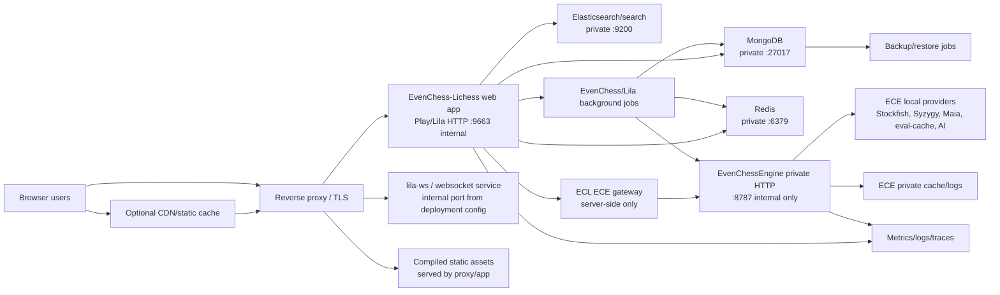

# EvenChess-Lichess Plan v1.6 Phase C - Production Architecture and Infrastructure Design

**Date:** 2026-06-03
**Phase:** C
**Status:** Conducted as the v1.6 production architecture baseline
**Repo:** EvenChess-Lichess
**Path:** `/home/jayde/dev/lila-docker/repos/lila`
**Branch:** `codex/evenchess-v1.6-readiness`

This document completes Plan v1.6 Phase C by defining the initial production topology, service map, network boundaries, ports, health checks, resource assumptions, scaling assumptions, staging parity, rollout shape, and architecture blockers for deploying EvenChess-Lichess with the separate private ECE service.

Phase C is architecture/design only. It does not implement deployment scripts, secrets, migrations, or server provisioning.

---

## 1. Phase C Decision Summary

Chosen v1.6 beta topology:

```text
Single Linux production host or VM with isolated service processes/containers on a private internal network.
```

Rationale:

- It is the fastest credible path from local development to public beta.
- It keeps ECL and ECE separately deployable while allowing low-latency server-to-server calls.
- It avoids Kubernetes/managed-orchestration complexity before the player pool and load profile are known.
- It preserves the option to move MongoDB, Redis, Elasticsearch, ECE, or workers onto separate hosts later.

Mandatory production boundary:

- ECL is public.
- ECE is private.
- Browser clients never call ECE analysis endpoints.
- ECE provider files, private paths, raw outputs, prompts, API keys, model weights, tablebases, caches, and generated DBs stay outside ECL.

Phase C acceptance status:

- Architecture diagram: complete.
- Service map: complete as baseline.
- Public/private network boundaries: complete.
- Resource assumptions: complete as initial beta estimates.
- Staging parity: complete as target design.
- Deployment independence from WSL/Docker Desktop/Test Ground: complete as requirement.
- Final server sizing and provider capacity: pending staging measurement.

---

## 2. Deployment Environments

| Environment | Purpose | Public access | ECE mode | Data persistence | Notes |
|---|---|---:|---|---|---|
| Local Test Ground | Developer testing | No | Local/test | Local dev only | May use WSL, Docker Desktop, Test ECE, and debug pages |
| Staging | Production-like validation | Restricted/admin only | `staging` | Durable staging data | Must mirror production topology and run real ECE |
| Production | Public beta/GA | Yes | `production` | Durable production data | No WSL, Docker Desktop, Test ECE, or public debug tools |

Local development may keep its existing `lila-docker` flow. Production must not depend on it.

---

## 3. Architecture Diagram



---

## 4. Network Boundary Rules

### 4.1 Public network

Public internet may reach only:

- reverse proxy on `80/tcp` and `443/tcp`;
- optional static asset/CDN endpoint;
- no direct database ports;
- no direct ECE ports;
- no Test Ground panel ports;
- no ECE CLM or ECE settings pages.

### 4.2 Private application network

Private network services:

- ECL app service;
- lila-ws service if deployed separately;
- MongoDB;
- Redis;
- Elasticsearch/search;
- ECE;
- metrics/log collectors;
- backup jobs.

### 4.3 ECE access rule

ECE must listen only on a private address/interface in production.

Allowed:

```text
ECL backend -> ECE /health
ECL backend -> ECE /ready
ECL backend -> ECE board/proposed/review endpoints
Operator via private admin/VPN/SSH tunnel -> ECE safe operator diagnostics
```

Forbidden:

```text
Browser -> ECE board/proposed/review endpoints
Public internet -> ECE
ECL frontend bundle -> ECE base URL
Production reverse proxy -> public ECE analysis endpoints
```

---

## 5. Service Inventory

Initial beta sizing is intentionally conservative. Staging must measure actual CPU, memory, and latency before public beta.

| Service | Role | Public port | Private port | Initial beta resources | Health check | Restart policy | Logs |
|---|---|---:|---:|---|---|---|---|
| Reverse proxy | TLS, HTTP routing, static compression, websocket routing | 80, 443 | n/a | 1 vCPU, 512 MB RAM | `/` and upstream checks | Always/on failure | access/error logs |
| ECL web app | Public Lichess/EvenChess app, setup, games, admin | none directly | 9663 | 4 vCPU, 8-12 GB RAM | app HTTP smoke route, admin health if added | Always/on failure | app logs, audit logs |
| lila-ws | Live websocket updates if deployed separately | none directly | deployment-configured internal port, recommended dedicated internal port | 1-2 vCPU, 1-2 GB RAM | websocket connect/smoke | Always/on failure | ws logs |
| MongoDB | Primary durable app data | none | 27017 | 2-4 vCPU, 8-16 GB RAM, SSD | `db.adminCommand({ ping: 1 })` | Always | database logs |
| Redis | Cache, pub/sub, short-lived coordination | none | 6379 | 1-2 vCPU, 1-4 GB RAM | `PING` | Always | redis logs |
| Elasticsearch/search | Search/index capabilities where Lila requires them | none | 9200 | 2-4 vCPU, 8-16 GB RAM, SSD | `GET /_cluster/health` | Always | search logs |
| ECE | Private EvenChess engine/coaching service | none | 8787 | 4-8 vCPU, 8-16 GB RAM baseline, more if Stockfish/Syzygy/AI load is high | `GET /health`, `GET /ready` | Always/on failure | ECE out/err/safe diagnostics |
| ECE providers | Stockfish/Syzygy/Maia/eval-cache/AI wrappers | none | local process/file/network as ECE config permits | CPU-heavy; reserve cores for Stockfish; disk-heavy for tablebases/cache | surfaced through ECE `/ready` | Managed by ECE | ECE provider-safe logs only |
| EvenChess background jobs | Retention, analysis memory, ECOR samples, bot sim cleanup, token jobs | none | internal only | 1-2 vCPU, 1-4 GB RAM | job heartbeat | Always/on schedule | job logs |
| Metrics/logging | Observability | restricted/admin | internal collector ports | 1-2 vCPU, 2-4 GB RAM | collector health | Always | metrics/log store |
| Backup jobs | DB/file backups and restore verification | none | internal only | burst CPU/disk | backup result status | Scheduled | backup logs |

Notes:

- The local config shows Lila default `http.port = 9663`, MongoDB URI default `127.0.0.1:27017`, and Redis default `redis://127.0.0.1`.
- ECE service URL remains `http://<private-ece-service>:8787` for production, not a browser URL.
- The lila-ws internal port must be confirmed from the chosen lila-ws deployment config during Phase S/T. If lila-ws is not split for beta, websocket routing remains whatever the selected Lila deployment uses.

---

## 6. Initial Server Sizing

### 6.1 Minimum staging host

Use at least:

```text
8 vCPU
32 GB RAM
250 GB SSD
```

This is enough to validate topology, ECL/ECE integration, bot tests, and small user loads if provider assets are not enormous.

### 6.2 Initial public beta host

Use at least:

```text
12-16 vCPU
48-64 GB RAM
500 GB to 1 TB SSD
```

Reason:

- Lila, MongoDB, Redis, search, ECE, Stockfish, and monitoring are running on the same host in the beta topology.
- ECE deep calls and provider work can be CPU-heavy.
- Syzygy/opening/eval-cache data can be disk-heavy.
- Bot simulation and ECOR calibration can create bursts.

### 6.3 Provider capacity guardrails

Initial production limits:

- cap concurrent ECE deep/provider calls;
- cap Stockfish processes or threads per process;
- cap full-game analysis concurrency;
- keep AI summaries disabled until cost/latency is measured;
- keep simulation bots disabled in production until Phase P gates pass;
- queue or drop non-critical ECE work before it affects legal move play or clocks.

---

## 7. ECE Production Placement

Recommended v1.6 beta placement:

```text
Same Linux host as ECL, separate service/container, private network only.
```

ECE production requirements:

- run under service manager or container runtime;
- listen on private interface only;
- expose `/health` and `/ready` internally;
- receive `ECE_MODE=production`;
- require internal service auth if ECE supports `ECE_INTERNAL_API_KEY`;
- keep provider paths and API keys in ECE config only;
- keep debug IO logging off by default;
- write logs to private log path;
- expose safe readiness/provider status to ECL/admin only;
- never expose raw provider output or private paths in public payloads.

ECE production endpoint for ECL:

```text
ECE_BASE_URL=http://ece:8787
```

`ece` is a private service name, not a public DNS name.

---

## 8. Reverse Proxy Routing

Public reverse proxy responsibilities:

- terminate TLS;
- redirect HTTP to HTTPS;
- route normal HTTP traffic to ECL web app;
- route websocket traffic according to selected Lila/lila-ws deployment;
- serve or cache compiled static assets where appropriate;
- apply request-size limits;
- apply sane timeout defaults;
- block access to private/admin-only debug endpoints unless explicitly allowed through ECL auth.

Do not route public traffic to:

- ECE analysis endpoints;
- ECE `/ece/settings`;
- ECE `/api/ece/settings`;
- ECE CLM;
- Test Ground panel;
- local script endpoints.

---

## 9. Data and Storage Layout

Production storage categories:

| Category | Owner | Persistence | Backup | Public exposure |
|---|---|---:|---:|---:|
| MongoDB app data | ECL/Lila | Durable | Required | Through ECL only |
| Redis cache/pubsub | ECL/Lila | Ephemeral/operational | Optional, usually no | No |
| Search indexes | ECL/Lila | Rebuildable but operational | Optional plus rebuild plan | No |
| ECE provider assets | ECE | Durable private files | Required where hard to recreate | No |
| ECE cache | ECE | Durable or semi-durable | Optional based on cost | No |
| ECE logs/debug | ECE | Retained by policy | Optional/limited | No |
| ECL audit logs | ECL | Durable | Required | Admin only |
| Analysis memory | ECL | Durable with retention | Required | Through authorized ECL UI |
| Calibration samples | ECL | Durable capped to latest 1,000,000 | Required | Admin only |
| Token/payment ledgers | ECL | Durable | Required | User/admin through ECL |

No ECE provider asset path should be referenced from browser code or public JSON.

---

## 10. Background Jobs

The architecture must support background jobs for:

- expired search ticket cleanup;
- stale match contract cleanup;
- bot simulation ticket replenishment and cleanup;
- live ECE history retention;
- requested analysis retention;
- ECOR sample collection and calibration runs;
- token grants/spends/refunds and subscription sync;
- backup jobs;
- metrics aggregation;
- abuse/repeat-pairing checks.

For v1.6 beta these jobs can run in the ECL app process or a separate worker process, but production must treat them as named jobs with:

- heartbeat;
- logs;
- retry/backoff;
- idempotency;
- resource limits;
- failure alerts.

---

## 11. Scaling Assumptions

### 11.1 Beta scaling

Initial beta assumes:

- low to moderate concurrent users;
- ECE quick calls after every move;
- ECE deep calls only when level/provider policy requires them;
- bot fallback disabled initially, then admin-enabled after staging proof;
- bot simulation staging-only or production-disabled by default;
- full-game analysis disabled until token/storage gates pass.

### 11.2 Scale-up triggers

Move services off the single host when any of these occur:

- ECE deep-call latency exceeds the target under normal move load;
- Stockfish/provider CPU saturates and affects ECL response time;
- MongoDB memory/disk pressure affects app latency;
- search/index workload affects game play;
- bot simulation or analysis jobs interfere with live games;
- backups cannot complete within maintenance windows;
- monitoring shows noisy-neighbor contention between ECL and ECE.

### 11.3 Next topology after beta

Split into:

- ECL app host(s);
- ECE provider host(s);
- dedicated MongoDB host or managed MongoDB;
- dedicated Redis;
- dedicated search;
- separate worker host;
- centralized monitoring/logging.

---

## 12. Rollout and Deployment Shape

### 12.1 v1.6 beta rollout

Use controlled rolling deploy or blue/green where practical:

1. Build release artifact.
2. Deploy to staging.
3. Run migrations against staging.
4. Start private ECE.
5. Run ECE provider validation.
6. Start ECL app.
7. Run staging smoke.
8. Deploy production with risky flags off.
9. Enable public/casual first.
10. Enable rated only after ECR smoke.
11. Enable bot fallback only after staging proof and disclosure review.

### 12.2 Rollback requirements

Rollback must support:

- disable new EvenChess searches;
- allow active games to finish;
- disable ECE live help without breaking moves;
- disable deep payloads but keep quick or shell if needed;
- disable overlays/coach separately;
- disable rated EvenChess separately from casual;
- disable bot fallback/simulation;
- restore prior ECOR/base-level table;
- roll back app deploy;
- roll back ECE deploy;
- roll back or forward database migrations according to Phase E migration design.

---

## 13. Staging Parity Requirements

Staging must match production in:

- Linux host/service layout;
- reverse proxy and TLS behavior;
- private ECE access through service name;
- durable MongoDB/Redis/search services;
- ECE `/health` and `/ready`;
- feature flags;
- admin auth;
- monitoring/logging;
- backup/restore procedure;
- deployment scripts;
- same build artifact shape.

Staging may differ in:

- domain name;
- secret values;
- provider API limits;
- payment sandbox keys;
- lower resource sizes;
- restricted access list.

Staging must not use:

- Test ECE payload server as the primary ECE;
- WSL paths;
- Windows PowerShell lifecycle scripts;
- Docker Desktop assumptions;
- public debug cards by default.

---

## 14. Monitoring Requirements from Architecture

Minimum dashboards:

- ECL app health and request latency;
- websocket health;
- MongoDB health, disk, memory, slow queries;
- Redis health and memory;
- search health;
- ECE health/readiness;
- ECE quick/deep latency and error rate;
- Stockfish/provider latency and fallback rate;
- AI cost/latency when enabled;
- queue time and match creation rate;
- bot fallback/simulation state;
- stale payload rejection count;
- overlay render error count;
- token/analysis consumption;
- ECR settlement count and anomaly rate;
- backup success/failure.

Minimum alerts:

- ECL app down;
- ECE down or not ready;
- database down or disk pressure;
- Redis down;
- search unavailable;
- ECE latency above threshold;
- failed match creation spike;
- stale payload rejection spike;
- rating settlement failure;
- backup failure;
- admin feature flag changed.

---

## 15. Security Boundaries from Architecture

Required controls:

- reverse proxy is the only public ingress;
- ECE private port is firewalled from public internet;
- database ports are firewalled from public internet;
- admin routes require ECL admin auth and CSRF;
- ECE internal API key or equivalent service auth is required if ECE supports it;
- logs redact secrets and private provider paths;
- browser JSON exposes only deployment-safe search/game labels;
- Test Ground and ECE CLM/settings routes are local/private only;
- SSH/admin access is limited to operators.

---

## 16. Architecture Blockers Before Production

Phase C does not resolve these items; they must be completed by later phases:

1. Choose exact production host/provider and resource tier.
2. Decide whether databases run on the app host or managed/dedicated services.
3. Confirm lila-ws deployment mode and internal websocket port.
4. Write production deployment scripts/service units/container specs.
5. Define environment variable inventory and secrets storage in Phase D.
6. Define database schemas/migrations in Phase E.
7. Validate ECE provider resource use in staging.
8. Implement monitoring and alerts.
9. Test backup/restore.
10. Run staging smoke and load tests.

---

## 17. Phase C Acceptance Status

| Acceptance gate | Status | Notes |
|---|---|---|
| Hosting topology chosen | Complete | Single Linux host/private service topology for v1.6 beta |
| Service map defined | Complete | Section 5 |
| CPU/memory/disk assumptions defined | Complete as initial estimates | Must be measured in staging |
| Ports defined | Complete as baseline | ECL `9663`, Mongo `27017`, Redis `6379`, search `9200`, ECE `8787`; lila-ws port to confirm from deployment config |
| Health checks defined | Complete | Section 5 |
| Restart policies defined | Complete as service-manager/container policy | Section 5 |
| Logs defined | Complete as baseline | Section 5 and Section 14 |
| Public/private boundaries explicit | Complete | Sections 4, 7, 8, and 15 |
| Deployment independence from WSL/Docker Desktop/Test Ground | Complete as requirement | Production/staging must not depend on local tooling |
| Blue/green or rolling approach defined | Complete as rollout baseline | Section 12 |
| Staging parity defined | Complete | Section 13 |

Phase C is complete as a deployment architecture baseline. It is not production implementation.

---

## 18. Phase D Entry Criteria

Phase D can start from this architecture baseline.

Phase D must produce:

1. ECL environment variable inventory.
2. ECE environment variable inventory for integration, without copying ECE internals into ECL.
3. Public/private/secret config split.
4. Production `ECE_BASE_URL` backend-only config.
5. Feature flag config and default values.
6. Secret storage approach.
7. Safe debug policy.
8. Browser bundle/private URL checks.
